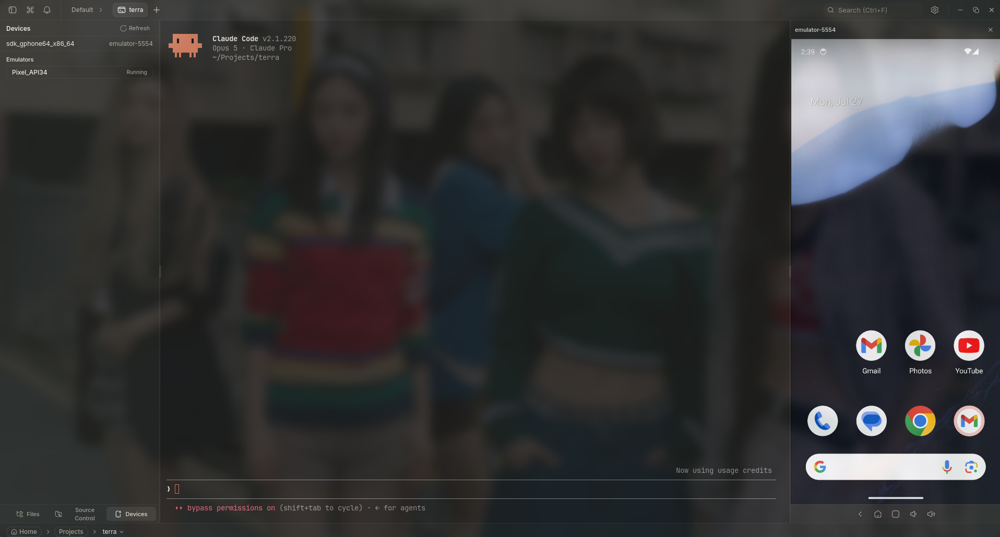
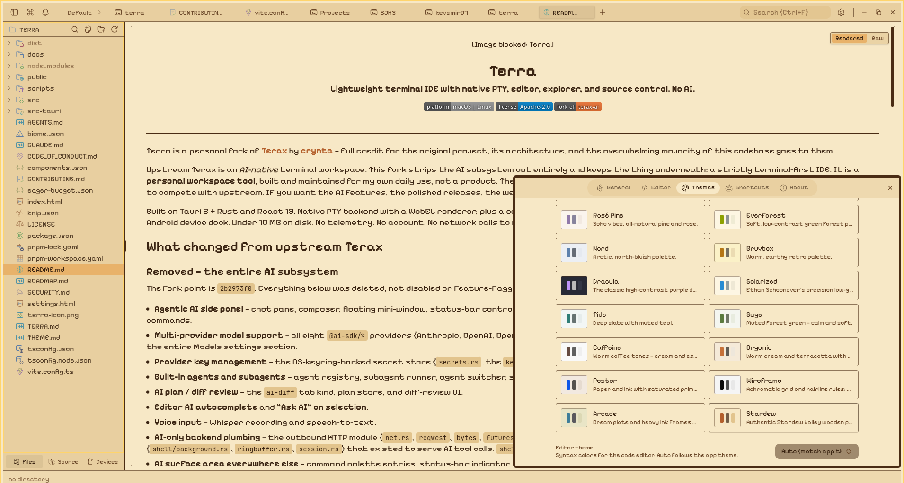

<div align="center">
  
  <h1>Terra</h1>

  <p><strong>Lightweight terminal IDE with native PTY, editor, explorer, and source control. No AI.</strong></p>

  <p>
    
    
    
  </p>
</div>

---

Terra is a personal fork of [**Terax**](https://github.com/crynta/terax-ai) by [**crynta**](https://github.com/crynta) — full credit for the original project, its architecture, and the overwhelming majority of this codebase goes to them.

Upstream Terax is an *AI-native* terminal workspace. This fork strips the AI subsystem out entirely and keeps the thing underneath: a strictly terminal-first IDE. It is a **personal workspace tool**, built and maintained for my own daily use, not a product. There is no support commitment, no roadmap promises to anyone but me, and no intent to compete with upstream. If you want the AI features, the polished releases, the website, and the community, go to [Terax](https://github.com/crynta/terax-ai).

Built on Tauri 2 + Rust and React 19. Native PTY backend with a WebGL renderer, plus a code editor, file explorer, source control with a git graph, a web preview pane, and an Android device dock. Under 10 MB on disk. No telemetry. No account. No network calls to model providers, because there is no model provider code left.

## What changed from upstream Terax

### Removed — the entire AI subsystem

The fork point is `2b2973f0`. Everything below was deleted, not disabled or feature-flagged:

- **Agentic AI side panel** — chat pane, composer, floating mini-window, status-bar controls, tool-approval prompts, todo strip, context chips, file/snippet pickers, slash commands.
- **Multi-provider model support** — all eight `@ai-sdk/*` providers (Anthropic, OpenAI, OpenAI-compatible, Google, Groq, xAI, Cerebras, React bindings) and the `ai` SDK itself, plus the entire Models settings section.
- **Provider key management** — the OS-keyring–backed secret store (`secrets.rs`, the `keyring` crate on macOS/Windows) and the provider key UI.
- **Built-in agents and subagents** — agent registry, subagent runner, agent switcher, status pills, run bridge, local agent notifications, and the Agents settings section.
- **AI plan / diff review** — the `ai-diff` tab kind, plan store, and diff-review UI.
- **Editor AI autocomplete** and **"Ask AI" on selection**.
- **Voice input** — Whisper recording and speech-to-text.
- **AI-only backend plumbing** — the outbound HTTP module (`net.rs`, `reqwest`, `bytes`, `futures-util`, `tokio`), the proxy fetch shim, and the background shell-session machinery (`shell/background.rs`, `ringbuffer.rs`, `session.rs`) that existed to serve AI tool calls. `shell_run_command` was kept and rewired, since format-on-save depends on it.
- **AI surface area everywhere else** — command palette entries, status-bar indicator, keyboard shortcuts, settings fields, and props threaded through `Header`, `WorkspaceInputBar`, and `FileExplorer`.

Net effect: ~22k lines deleted across 167 files, 11 npm dependencies and 5 Cargo dependencies dropped. What remains is terminal, editor, git, files, preview.

> Note: OSC 777 agent detection and status notifications are still here. That is *terminal* integration — it surfaces what a CLI agent running inside a PTY is doing. Terra runs no models itself.

### Added in this fork

- **Embedded Android device preview** — render a running emulator or attached device inside Terra. Bundles `scrcpy-server.jar` (Apache-2.0), streams raw H.264 over ADB, and decodes via Media Source Extensions. Includes a resizable, collapsible right-hand device dock with persisted width, a serial header, device picker, and stop control.
- **Binary touch control bridge** — low-latency scrcpy binary control protocol over a dedicated socket (multi-touch, scroll, keys), with `adb shell input` as automatic fallback when the control channel drops.
- **1-click AVD launch** — list, boot, and stop system AVDs headless from the Devices panel, with cross-platform Android SDK discovery and owned emulator lifecycle (stale servers killed, everything torn down on app exit).
- **Dev-server auto-detection** — the PTY watches for loopback URLs in shell output and offers the detected server as a one-click chip on the preview pane; the listener clears on shell exit.
- **Project profiles and auto-launch** — Spaces now persist panel split ratios and run startup commands (`startupCommands: ["pnpm dev", "pi"]`) when a space opens, configurable per-space from a settings popover.
- **Live filesystem sync** — the explorer re-reads affected directories and open editor tabs reload on fs-watch events. A dirty buffer is never clobbered; the pane instead surfaces whether the file changed or vanished on disk, with an explicit reload-or-recreate action.
- **Copy on selection** — opt-in, off by default. A drag-selection is copied on mouse-up, with a toast on a confirmed clipboard write. Off by default because a webview cannot reach the X11 primary selection, so this replaces the clipboard rather than a separate buffer. Independently of the preference, horizontal drag-selections are no longer swallowed by block selection.
- **Enforced startup bundle budget** — the eager startup set is measured from the built HTML (entry script plus every `modulepreload`) and gated in CI alongside `knip`, replacing hand-maintained globs that under-reported the eager set by 43%. The updater dialog and device surfaces were moved out of the startup graph behind lazy wrappers.
- **Fixes** — markdown preview now scrolls inside a `ScrollArea`, the minimum window size was raised to something the layout can actually satisfy, and preferences hydrate in the main window on every launch.
- Renamed Terax → Terra throughout, and simplified the release workflows.

## Screenshots

<table>
  <tr>
    <td align="center"><br/><sub>Embedded Android device preview</sub></td>
    <td align="center"><br/><sub>Custom themes, presets, and background images</sub></td>
  </tr>
  <tr>
    <td align="center"><br/><sub>Web preview of local dev servers</sub></td>
    <td align="center"><br/><sub>Source control panel with git graph in history</sub></td>
  </tr>
</table>

## Features

### Terminal

- xterm.js with WebGL renderer, multi-tab with background streaming
- GPU-accelerated block-based terminal with editor-like command input
- Native PTY backend via `portable-pty` (zsh, bash, pwsh, fish, cmd)
- Split panels (horizontal and vertical) with tree serialization and layout restore
- Inline search, link detection, true-color
- History-based inline suggestions with ghost text and path completion
- Opt-in copy on selection
- Per-tab workspace environments on Windows (Local, or any installed WSL distro)

### Code editor

- CodeMirror 6 (supports all popular languages - TS/JS, Rust, Python, Go, C/C++, Java, HTML/CSS, JSON, Markdown, etc.)
- Vim mode
- Hybrid diagnostics: zero-RAM on-save checks by default, with a ref-counted lazy LSP session that idles down
- Ten built-in editor themes: Atom One, Aura, Copilot, GitHub Dark / Light, Gruvbox Dark, Nord, Tokyo Night, Xcode Dark / Light

### Source control

- Stage / unstage hunks, commit (Cmd+Enter / Ctrl+Enter), push with upstream awareness
- Branch display including detached HEAD state
- Git history pane with a real commit graph (lane rendering for merges and branches)
- Commit search and filter, click through to the remote commit page

### File explorer

- Catppuccin icon theme
- Fuzzy search, keyboard navigation, inline rename, context actions
- Live sync with on-disk changes

### Web preview

- Auto-detects local dev servers and opens them in a preview tab
- External URL preview via a native child webview

### Device dock

- Android emulator / device screen mirrored into a resizable right-hand dock
- Multi-touch, scroll, and key input over the scrcpy binary control protocol
- Launch and stop AVDs without leaving the app

### Themes and customization

- Custom themes built in-app, switch between bundled presets and your own
- Create your own themes, share them or import from the community
- Background images with adjustable opacity and blur
- Editor theme is independent from the app theme

## Install

This is a personal fork, so the primary path is building from source. Tag-triggered CI in this repo produces Linux (`.deb` / `.rpm` / AppImage) and macOS (`.dmg`) bundles if you want to cut your own build.

For prebuilt, signed, regularly released installers — plus the AUR package and Nix flake — use [upstream Terax](https://github.com/crynta/terax-ai/releases/latest) instead.

### Windows

Windows is not a released platform for this fork — no prebuilt bundle is published and no build here is ever run on Windows. The Windows code paths are still in the tree and still compiled and unit-tested in CI, so building from source should work: clone the repo and run `pnpm tauri build`. Treat it as untested.

- Builds from this fork are not code-signed, so Windows shows "Windows protected your PC" on first launch. Click **More info** then **Run anyway**. (Upstream Terax has Windows builds signed via SignPath.)
- Default shell detection: `pwsh.exe` (PowerShell 7+) -> `powershell.exe` (Windows PowerShell 5.1) -> `cmd.exe`.
- WSL is a first-class workspace environment, not a wrapped subprocess.

### Linux notes

- **AppImage:** needs FUSE. Without it: `./Terra_*.AppImage --appimage-extract-and-run`. On Wayland with rendering glitches, try `WEBKIT_DISABLE_DMABUF_RENDERER=1`. Otherwise the `.deb` / `.rpm` packages link against the system GTK stack and tend to be smoother.

### Device dock requirements

The Android device dock needs `adb` on your `PATH` or a discoverable Android SDK install. `scrcpy-server.jar` ships bundled — no separate scrcpy install required.

## Build from source

**Prerequisites**
- Rust (stable), https://rustup.rs
- Node 20+ and [pnpm](https://pnpm.io)
- Tauri prerequisites for your platform, https://tauri.app/start/prerequisites/

**Run**
```bash
pnpm install
pnpm tauri dev          # development
pnpm tauri build        # production bundle
```

**Checks**
```bash
pnpm lint
pnpm check-types
pnpm test
cd src-tauri && cargo clippy --all-targets --locked -- -D warnings   # Rust lint (matches CI)
cd src-tauri && cargo nextest run --locked                           # or: cargo test --locked
```

## Tech stack

Tauri 2, Rust, `portable-pty`, React 19, TypeScript, Vite, xterm.js, CodeMirror 6, Tailwind v4, shadcn/ui, Zustand.

## Contributing

This is a personal workspace tool, so contributions are not really expected here — issues and PRs are more useful [upstream at Terax](https://github.com/crynta/terax-ai). That said, if you're using this fork and hit something broken, feel free to open an issue. See [CONTRIBUTING.md](CONTRIBUTING.md) and the [architecture docs](docs/README.md) for how the codebase is laid out.

## Credits

- [**crynta**](https://github.com/crynta) — creator of [Terax](https://github.com/crynta/terax-ai), the project this is forked from. Nearly all of the terminal, editor, git, explorer, preview, and theming work is theirs.
- [scrcpy](https://github.com/Genymobile/scrcpy) — `scrcpy-server.jar` is bundled for the device dock (Apache-2.0).

## License

Terra is licensed under the Apache-2.0 License, inherited from upstream Terax. For more information on our dependencies, see [Apache License 2.0](LICENSE).
