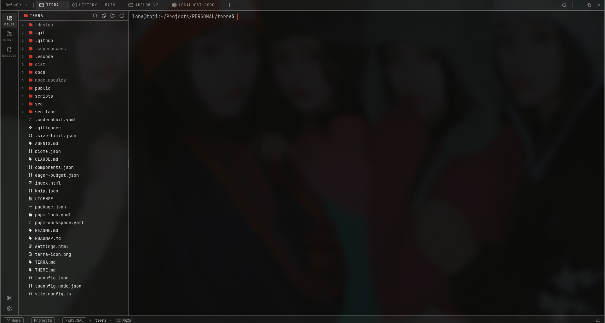
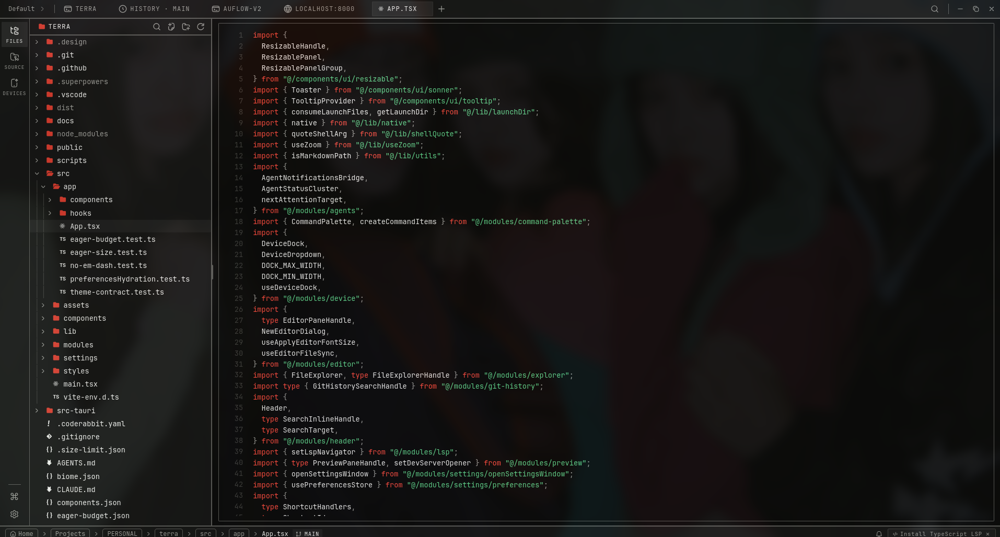
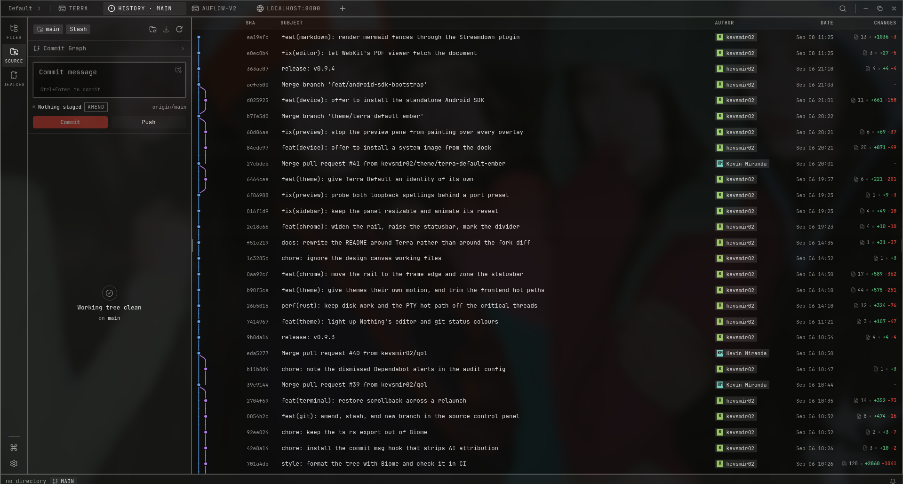
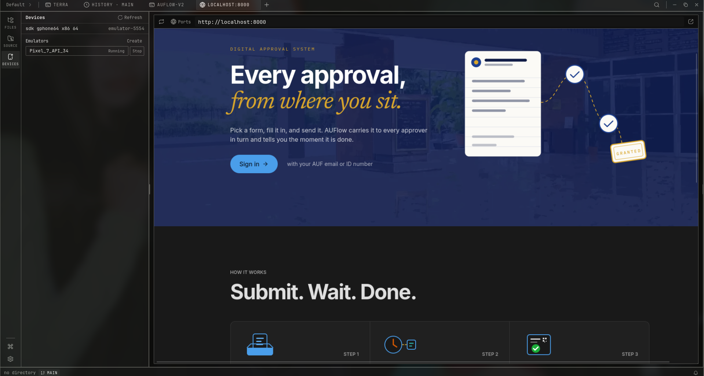
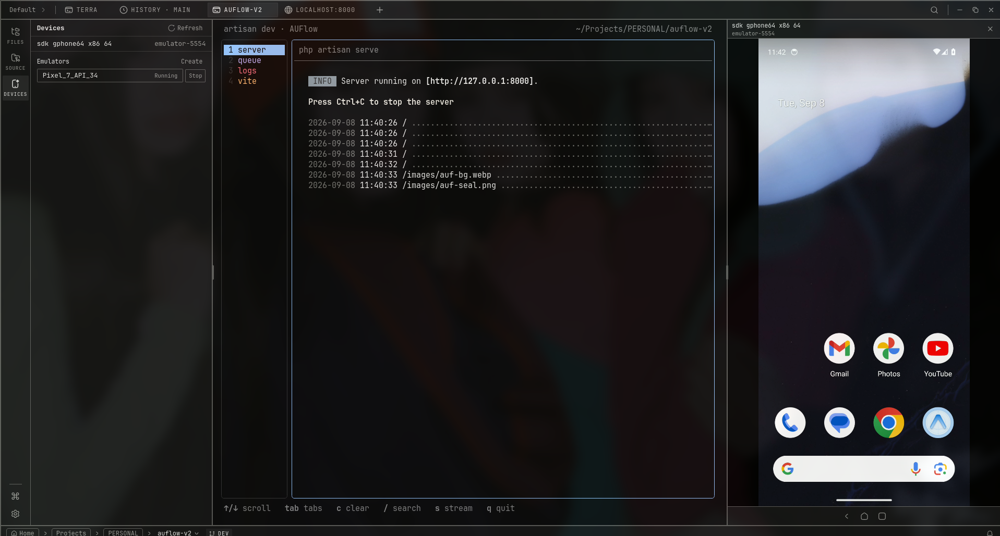
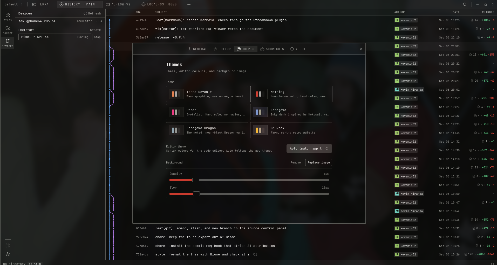

<div align="center">
  
  <h1>Terra</h1>

  <p><strong>A terminal-first IDE for people who work through agent harnesses. Native PTY, editor, explorer, and source control, each on demand. No built-in AI.</strong></p>

  <p>
    
    
    
  </p>
</div>

---

## What Terra is

Terra is for developers who spend the day driving agent harnesses (Claude Code, Codex, OpenCode, Gemini CLI, Pi, Antigravity) rather than typing code by hand.

The terminal is the product. The editor, explorer, source control, preview pane, language servers, and device dock exist so you can read, verify, and touch up what an agent produced without leaving the window. Each of them is **on demand**: while it is closed there is no process, no thread, no timer, and nothing in the startup bundle beyond the shell that offers to turn it on. That is measured rather than asserted; the eager startup graph is budgeted per window and gated in CI.

Terra runs no models. No telemetry, no account, no provider keys, and no outbound HTTP beyond the signed updater. Every path that reaches the disk or spawns a process goes through one authorization registry.



## What it offers

### Terminal

xterm.js with the WebGL renderer over a native PTY (`portable-pty`, zsh, bash, fish). Tabs keep streaming while hidden, split panes restore their layout, and scrollback survives a relaunch. Prompt and command boundaries come from OSC 133, so you can jump between commands, select or copy the last output, and follow path-shaped tokens straight into the editor at the right line. Hidden panes with a live job keep their grid parked in a pooled renderer slot rather than being redrawn from a snapshot, so a running TUI is never wiped.

### Agent awareness

Detection runs on the PTY byte stream and costs nothing when no agent is running. A tab shows whether its agent is working, waiting on you, or finished; a split marks which pane is asking; the statusbar aggregates across panes, and an unfocused window gets an OS notification instead. Hook installers ship for Claude Code and Codex, and any CLI that rings the bell works without one.

### Editor

CodeMirror 6 with per-file EOL and indent detection, saves conflict-checked against the file's mtime rather than last-writer-wins, and opt-in language servers that idle down after three minutes and run under a memory watchdog. Go to definition, references, diagnostics, and format on save go through the active server; nothing spawns until you enable a language.



### Source control

Stage, unstage, commit, amend, stash, create branches, and push with upstream awareness, plus a history pane with a real commit graph and per-file diffs.



### Explorer

Theme-selected icon sets, fuzzy search, content search, keyboard navigation, inline rename, and live sync with fs-watch that never clobbers a dirty buffer.

### Preview

Dev-server URLs are detected off the PTY and offered as a one-click chip, cleared when the shell exits. The preview tab is scoped to local dev servers and lightweight viewing: markdown renders live, with Mermaid diagrams, and image, PDF, video, and audio viewers alongside.



### Device dock

A running Android emulator or attached device mirrored into a resizable dock. `scrcpy-server.jar` ships bundled, so no separate scrcpy install is needed: H.264 over ADB, decoded through Media Source Extensions, with multi-touch, scroll, and keys sent back over the scrcpy control protocol. AVDs list, boot, and stop from the panel, and everything Terra started dies on exit. With no SDK or no system image on disk, the dock offers to install one in a terminal tab, in front of you.



### Spaces

Per-project tabs, root, environment, colour, panel split ratios, and startup commands that run when the space opens.

### Themes

Bundled presets and an in-app builder. A theme owns more than colour: radius, border width and style, motion, chrome casing, the icon set, and the terminal palette that the editor's syntax roles are derived from and contrast-normalized against. Your own wallpaper shows through the chrome when the theme allows it.



## Status

This is a personal workspace tool, not a product.

- **One maintainer, no support.** I work on it when I need something. Updates land when they land.
- **Linux only.** Developed and used on Fedora; it should run on any current Linux with WebKitGTK.
- **Public so you can fork it.** Apache-2.0. Take whatever is useful.
- **Issues are fine, promises are not.** If something is broken you are welcome to open an issue, but expect no timeline.

## Build

Prerequisites: Rust stable, Node 20+, [pnpm](https://pnpm.io), and the [Tauri Linux prerequisites](https://tauri.app/start/prerequisites/). On Fedora that is roughly:

```bash
sudo dnf install webkit2gtk4.1-devel openssl-devel curl wget file libappindicator-gtk3-devel librsvg2-devel
sudo dnf group install "c-development"
```

Then:

```bash
pnpm install
pnpm tauri dev      # development
pnpm tauri build    # .deb, .rpm, and AppImage under src-tauri/target/release/bundle
```

Checks, which is what CI runs. `TERRA.md` has the full definition of done.

```bash
pnpm lint
pnpm check-types
pnpm test
pnpm build && pnpm size:eager      # eager startup budget per window
pnpm knip
pnpm audit --prod && pnpm audit
cd src-tauri && cargo clippy --all-targets --locked -- -D warnings
cd src-tauri && cargo nextest run --locked                           # or: cargo test --locked
cd src-tauri && cargo audit
```

Pushing a tag runs `release.yml`, which builds and signs the Linux bundles.

### Linux notes

- **AppImage** needs FUSE. Without it: `./Terra_*.AppImage --appimage-extract-and-run`. On Wayland with rendering glitches try `WEBKIT_DISABLE_DMABUF_RENDERER=1`. The `.rpm` and `.deb` link against the system GTK stack and tend to be smoother.
- **Device dock** needs `adb` on your `PATH` or a discoverable Android SDK. `scrcpy-server.jar` ships bundled, so no separate scrcpy install is required.

## Docs

- [`TERRA.md`](TERRA.md): architecture, invariants, budgets, and the definition of done. Loaded as agent memory.
- [`ROADMAP.md`](ROADMAP.md): what is next and what stays out.
- [`THEME.md`](THEME.md): authoring a theme.
- [`docs/`](docs/): two long-form guides (terminal renderer pool, device mirroring) and the decision records.

## Tech stack

Tauri 2, Rust, `portable-pty`, React 19, TypeScript, Vite, xterm.js, CodeMirror 6, Tailwind v4, shadcn/ui, Zustand.

## Credits

- [**crynta**](https://github.com/crynta): creator of [Terax](https://github.com/crynta/terax-ai), the AI-native workspace Terra is built on. The terminal, editor, git, explorer, preview, spaces, and theming foundations are theirs, and a great deal of that work still stands underneath what is here. If you want the AI features, a cross-platform build, and people to talk to, go to [Terax](https://github.com/crynta/terax-ai). It is the better choice for almost everyone.
- [scrcpy](https://github.com/Genymobile/scrcpy): `scrcpy-server.jar` is bundled for the device dock (Apache-2.0).

## License

Apache-2.0, inherited from upstream Terax, which holds the copyright on the original work. See [LICENSE](LICENSE).
